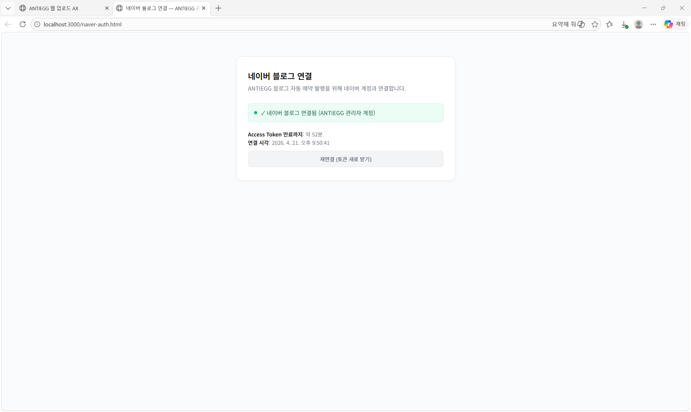
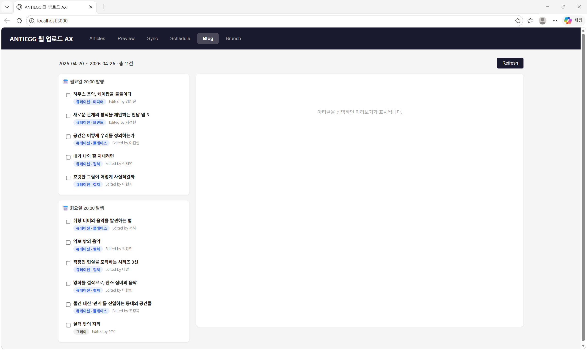
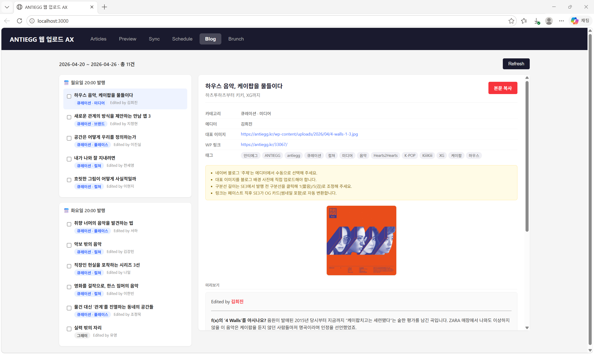
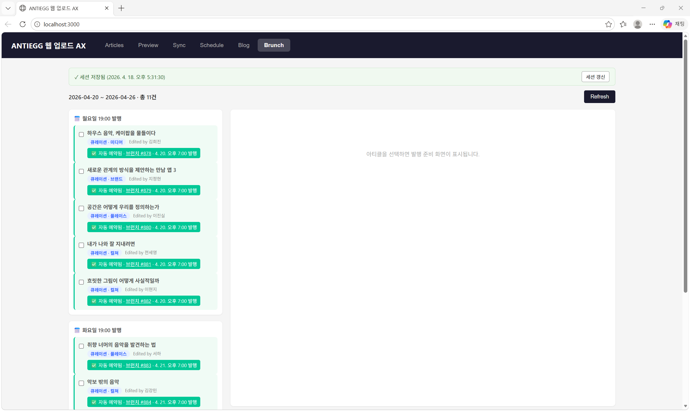

# ANTIEGG 네이버 블로그 예약 발행 도구 서비스 소개서

> 네이버 로그인 검수 승인 재신청용 서비스 소개 자료
> 작성일: 2026-04-21
> 작성자: ANTIEGG팀
> 문의: editor@antiegg.kr

---

## 1. 서비스 개요

| 항목 | 내용 |
|---|---|
| 서비스명 | ANTIEGG 매거진 네이버 블로그 자동 예약 발행 도구 |
| 운영 주체 | ANTIEGG (antiegg.kr) — 프리랜서 에디터 공동체 |
| 서비스 성격 | **관리자 전용 내부 운영 도구** (외부 사용자 없음) |
| 대상 블로그 | https://blog.naver.com/antiegg (ANTIEGG 공식 블로그 1개) |
| 발행 빈도 | 주 2회 (매주 월요일, 화요일 19:00 자동 예약 발행) |
| 사용자 수 | ANTIEGG 매거진 운영팀 내부 담당자 1~2명 |
| 앱 개설자 계정 | ANTIEGG 운영 담당자의 네이버 개인 계정 (실명: 이준용, 프로필 별명: 이형운) |
| 계정 용도 | ANTIEGG 법인의 공식 블로그 blog.naver.com/antiegg 소유·운영 전용 |

### 서비스의 본질

본 도구는 **ANTIEGG가 자사 WordPress 매거진(antiegg.kr)에 발행한 콘텐츠를 자사 네이버 블로그에 연동 재발행**하기 위한 **내부 자동화 도구**입니다. 일반 사용자가 가입하거나 이용하는 대외 서비스가 아닙니다.

**계정 구조**:
- ANTIEGG는 사업자 등록된 법인
- 법인의 유일한 네이버 활동 계정 = ANTIEGG 운영 담당자 이준용의 개인 네이버 계정
- **네이버 개발자센터 앱 개설자 · blog.naver.com/antiegg 소유자 · OAuth 인증 계정이 모두 동일**
- 외부 제3자의 계정이나 블로그에 일체 접근하지 않음

---

## 2. 검수 승인이 필요한 사유

네이버 측에서 "관리자 전용 내부 도구는 개발중 상태로 이용 가능"하다는 안내를 받았으나, **기술적으로 개발중 상태에서는 서비스 운영이 불가능**함을 아래와 같이 소명드립니다.

### 2-1. 개발중 모드에서 writePost API 미제공 확인

개발자센터에 앱 개설자 계정(ANTIEGG)으로 OAuth 로그인하여 access_token을 발급받은 후, `POST /blog/writePost.json`을 호출한 결과:

```
HTTP 404
{
  "errorMessage": "/blog/writePost.json : API does not exist.",
  "errorCode": "051"
}
```

이는 `writePost.json` 엔드포인트가 **검수 승인을 받은 앱에 한해 활성화**됨을 의미합니다. 개발중 상태에서는 기본 네이버 로그인(프로필 조회) API만 사용 가능하며, 블로그 쓰기 API는 호출 자체가 불가능합니다.

### 2-2. 지속적·정기적 자동 호출이 필수

- 매주 월요일·화요일 19:00에 자동 예약 발행이 동작해야 함
- 콘텐츠 발행 리듬이 ANTIEGG 매거진 운영의 핵심 일정이므로 수동 발행으로 대체 불가
- OAuth + writePost API의 안정적·공식적 경로가 필요

### 2-3. 단일 블로그·단일 계정·단일 용도

- 외부 사용자 가입/로그인 없음
- ANTIEGG 1개 계정의 OAuth 토큰으로 ANTIEGG 1개 블로그에만 접근
- 수집·저장하는 사용자 정보 없음 (제3자 정보 처리 無)
- 네이버 로그인 운영원칙·약관·관계 법령상 문제 소지 없음

---

## 3. 대상 블로그 및 게시글 유형

### 3-1. 대상 블로그

| 항목 | 내용 |
|---|---|
| 블로그 URL | https://blog.naver.com/antiegg |
| 블로그명 | ANTIEGG 매거진 |
| 소유자 | ANTIEGG (앱 개설자 네이버 계정과 동일) |
| 카테고리 | 문화예술 큐레이션, 아티스트 인터뷰, 디자인·컬쳐 콘텐츠 |

### 3-2. 게시글 유형

발행되는 게시글은 모두 **ANTIEGG가 자체 제작한 매거진 콘텐츠**이며, antiegg.kr 원문으로의 유입을 유도하는 티저 형태입니다.

| 구성 요소 | 설명 |
|---|---|
| 제목 | WordPress 원문과 동일 |
| 본문 서두 | 원문 도입부 (첫 `<hr>` 전까지, 대략 300~500자) |
| 대표 이미지 | WordPress에서 동기화된 이미지 |
| 본문 말미 | "원문에서 이어 읽기" CTA + antiegg.kr 원문 링크 (OG 카드 자동 변환) |
| 하단 | ANTIEGG 브랜드 소개 + 구독 유도 문구 |
| 태그 | 카테고리, 테마, 키워드 (보일러플레이트 + 아티클별 자동 생성) |

**게시글 예시 샘플** (현재 수동 복붙으로 운영 중인 실제 발행분):
- 큐레이션 카테고리: https://blog.naver.com/antiegg/224253806102
- 그레이 카테고리: https://blog.naver.com/antiegg/224253777276

> ※ 위 URL은 현재 수동 발행된 실제 포스트이며, 자동화 후에도 동일한 포맷·구성으로 발행됩니다.

---

## 4. 발행 방식 및 과정 (전체 데이터 흐름)

### 4-1. 전체 흐름도

```
┌─────────────────────────┐
│  Ghost CMS              │
│  (square.antiegg.kr)    │  ← 에디터가 원고 작성
└───────────┬─────────────┘
            │ 매주 금요일 09:00 자동 동기화
            ↓
┌─────────────────────────┐
│  WordPress              │
│  (antiegg.kr)           │  ← 매거진 본발행 플랫폼
└───────────┬─────────────┘
            │ 매주 월/화 발행분 fetch
            ↓
┌─────────────────────────┐
│  본 도구 (내부 서버)    │
│  - WP 아티클 조회       │
│  - 네이버 블로그 포맷   │
│  - OAuth 토큰 관리      │
└───────────┬─────────────┘
            │ 월/화 19:00 자동 실행 (cron)
            ↓
┌─────────────────────────┐
│  네이버 블로그 API      │
│  /blog/writePost.json   │
└───────────┬─────────────┘
            ↓
┌─────────────────────────┐
│  blog.naver.com/antiegg │
│  (자동 발행 완료)       │
└─────────────────────────┘
```

### 4-2. 단계별 상세 설명

| # | 단계 | 내용 |
|---|---|---|
| 1 | 원고 수집 | Ghost CMS에 ANTIEGG 에디터들이 원고 작성 |
| 2 | WP 동기화 | 매주 금요일 09:00 Ghost → WordPress 자동 동기화 (예약 발행 상태로 저장) |
| 3 | 주간 큐레이션 | 다음 주 월요일/화요일에 발행될 아티클을 자동 분배 |
| 4 | 포맷 변환 | WordPress HTML → 네이버 SE3 에디터 호환 마크업으로 변환 (SE3 컴포넌트 클래스 사용) |
| 5 | OAuth 인증 | ANTIEGG 관리자 계정 OAuth 2.0 토큰으로 네이버 API 인증 |
| 6 | 예약 발행 요청 | `POST /blog/writePost.json` 호출 (제목·본문·카테고리·태그 포함) |
| 7 | 발행 완료 | blog.naver.com/antiegg에 해당 월/화 19:00으로 예약된 포스트 등록 |
| 8 | 발행 기록 | 내부 상태 파일에 logNo/postUrl 저장 → 중복 발행 방지 |

---

## 5. 메뉴별 상세 설명 (관리자 UI 화면)

본 도구는 로컬 서버(`http://localhost:3000`)에서 실행되는 관리자 전용 웹 인터페이스를 제공합니다. 외부 공개되지 않으며, ANTIEGG 운영 담당자만 접근 가능합니다.

### 5-1. 네이버 로그인 연결 페이지 (`/naver-auth.html`)



- **목적**: ANTIEGG 관리자 계정과 네이버 OAuth 연결
- **구성**:
  - 연결 상태 배지 (녹색: 연결됨 / 주황: 미연결)
  - "네이버로 로그인" 버튼 → 네이버 공식 인증 페이지로 이동
  - Access Token 만료까지 남은 시간 표시
  - 최초 연결 시각 표시
  - "재연결" 버튼 (토큰 수동 갱신용)
- **동작**:
  1. 버튼 클릭 → `/api/naver/auth/start` → 네이버 인증 페이지 302 리다이렉트
  2. 네이버 로그인 + 권한 동의 완료
  3. `/api/naver/auth/callback?code=...&state=...` 콜백 수신
  4. 토큰 교환 → `.naver-tokens.json`에 저장 → 연결 완료 화면 복귀

### 5-2. 주간 발행 대시보드 — 네이버 탭 (`/index.html` → Blog 탭)



- **목적**: 다가오는 주의 월/화 예약 발행 아티클 확인 및 관리
- **구성**:
  - 좌측 패널: 월요일/화요일 그룹별 아티클 카드 리스트
    - 제목, 카테고리, 에디터명, 발행 예정 시각 표시
  - 우측 패널: 선택한 아티클의 네이버 블로그용 포맷 미리보기
  - 예약된 아티클은 녹색 테두리 + "✅ 자동 예약됨 · MM/DD HH:mm 발행" 배지
- **기본 주 표시 로직**: 월/화요일에 열면 이번 주, 수~일요일에 열면 다음 주 표시 (getCurrentKstWeek)

### 5-3. 아티클 포맷 미리보기 및 발행 요청



- **목적**: 발행 직전 포맷 확인 및 수동 트리거
- **구성**:
  - 제목, 본문, 태그, 카테고리 확인
  - 발행 모드 선택:
    - 예약 발행 (기본): 월/화 19:00
    - 즉시 발행 (수동 운영 시)
  - 발행 버튼 클릭 시 `/blog/writePost.json` 호출

### 5-4. 예약 현황 조회 — 자동 예약 완료 배지 UI



- **목적**: 이미 예약된 포스트 중복 방지 및 이력 조회
- **구성**: 예약 완료된 아티클 카드에 "✅ 자동 예약됨 · MM/DD HH:mm 발행" 녹색 배지 표시
- **참고**: 위 캡처는 동일 도구의 브런치 탭 구현 상태이며, 네이버 검수 승인 후 네이버 탭에도 동일한 UX 패턴을 적용합니다 (자동 예약된 아티클 녹색 테두리 + 배지)
- **중복 방지**: 내부 상태 파일(`.naver-publish-state.json`)에 WP 원문 ID와 네이버 logNo 매핑 저장

### 5-5. 자동화 스케줄러 (백그라운드)

사용자 UI는 없지만 서버에서 상시 동작:

```
cron: "0 8 * * *"  (매일 08:00 KST)
→ runNaverAutoReserve()
→ 다가오는 월/화 아티클 중 미예약분 찾아 자동 예약
→ 중복 방지: .naver-publish-state.json에 wpId 기록
```

---

## 6. 사용 API 스코프

| API | 엔드포인트 | 용도 | 필요 권한 |
|---|---|---|---|
| 네이버 로그인 | `https://nid.naver.com/oauth2.0/authorize` | ANTIEGG 관리자 계정 인증 | 기본 로그인 |
| 토큰 교환 | `https://nid.naver.com/oauth2.0/token` | code → access_token 교환 | — |
| 토큰 갱신 | `https://nid.naver.com/oauth2.0/token` | refresh_token으로 갱신 | — |
| 프로필 조회 | `https://openapi.naver.com/v1/nid/me` | 연결 상태 확인용 | 기본 로그인 |
| 블로그 글쓰기 | `https://openapi.naver.com/blog/writePost.json` | ANTIEGG 블로그에 포스트 발행 | **검수 승인 필요** |

**사용하지 않는 스코프**:
- 카페, 메일, 캘린더, 쇼핑 등 여타 네이버 API 일체 사용 안 함
- 타인 블로그 접근 없음
- 블로그 글 수정·삭제 API 사용 안 함 (발행만)

---

## 7. 보안 및 개인정보 처리

### 7-1. 수집·저장하는 정보

| 대상 | 정보 | 저장 위치 | 목적 |
|---|---|---|---|
| ANTIEGG 관리자 계정 | OAuth access_token, refresh_token | 로컬 서버 `.naver-tokens.json` (git 제외) | 자사 블로그 API 인증 |

### 7-2. 수집·저장하지 않는 정보

- 외부 사용자 정보 (서비스에 가입하는 외부 이용자 자체가 없음)
- 네이버 프로필 상세 정보, 이메일, 전화번호 등
- 제3자 정보

### 7-3. 토큰 보호

- `.naver-tokens.json`은 `.gitignore`로 버전 관리 제외
- 로컬 서버 외부로 토큰 전송하지 않음
- 토큰 만료 60초 전 자동 refresh, 만료 시 재로그인 유도

### 7-4. 서비스 정상 운영 저해 요소 無

- 스팸/도배성 자동 발행 아님: 주 2회 · 매회 1개 포스트
- 콘텐츠는 antiegg.kr에서 실제 발행된 매거진 원문 기반
- 네이버 블로그 생태계에 정상적인 콘텐츠만 유입

---

## 8. 운영 주체 정보

| 항목 | 내용 |
|---|---|
| 법인 형태 | 사업자 등록된 법인 |
| 법인명 | ANTIEGG (프리랜서 에디터 공동체) |
| 운영 담당자 | 이준용 (프로필 별명: 이형운) — 네이버 개발자 앱 개설자 및 블로그 소유 계정 |
| 웹사이트 | https://antiegg.kr |
| 네이버 블로그 | https://blog.naver.com/antiegg |
| 서비스 이력 | 2020년 시작, 현재 ANTIEGG 3.0 (프리랜서 에디터 공동체 단계) |
| 발행 콘텐츠 | 누적 1,500개 이상, 월간 조회 80만+ |
| 팀 구성 | Product Team, Content Team, Creative Team, Business Team (약 60명) |
| 문의 이메일 | editor@antiegg.kr |

---

## 9. 요약

| 핵심 확인 사항 | 답변 |
|---|---|
| 외부 사용자가 가입·이용하는 서비스인가? | ❌ 아니오. ANTIEGG 내부 관리자 1~2명만 사용 |
| 개발중 모드로 운영 가능한가? | ❌ 아니오. writePost API가 검수 승인 앱에만 제공됨 (404 확인) |
| 타인 블로그에 접근하는가? | ❌ 아니오. ANTIEGG 자사 블로그 1개만 대상 |
| 수집하는 사용자 정보가 있는가? | ❌ 없음. 자사 OAuth 토큰만 로컬 저장 |
| 스팸·도배 우려가 있는가? | ❌ 없음. 주 2회 자체 제작 매거진 콘텐츠만 발행 |
| 검수 승인이 필요한 이유는? | ✅ writePost API 사용을 위해 공식 승인 경로가 유일한 운영 방법 |

ANTIEGG는 자사 매거진 콘텐츠를 자사 네이버 블로그에 안정적·정기적으로 재발행하기 위한 **공식 API 승인**을 요청드립니다. 본 도구는 네이버 로그인 운영원칙, 약관, 관계 법령을 준수하며, 포털 서비스의 정상 운영을 저해할 어떠한 요소도 포함하지 않습니다.

검수 과정에서 추가로 필요한 자료나 확인이 있으시면 editor@antiegg.kr로 말씀해주시면 즉시 제공드리겠습니다. 감사합니다.
